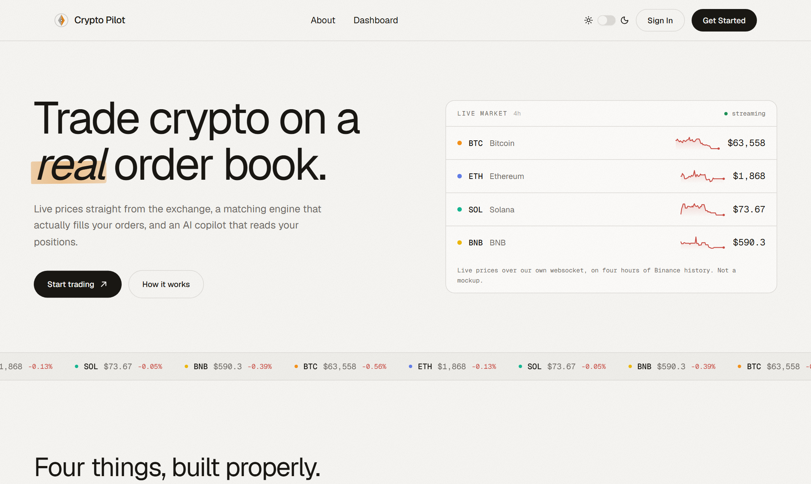
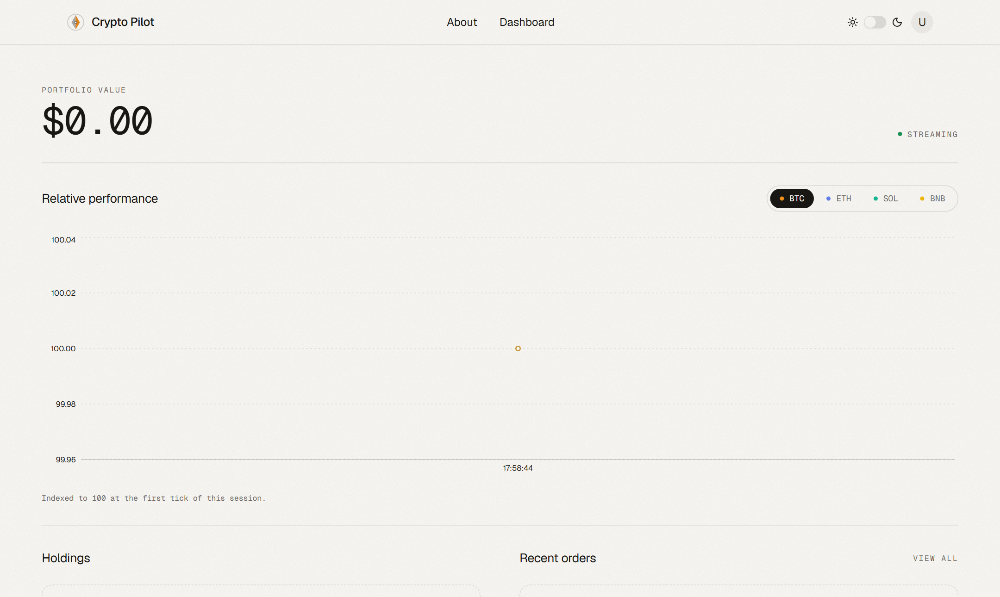
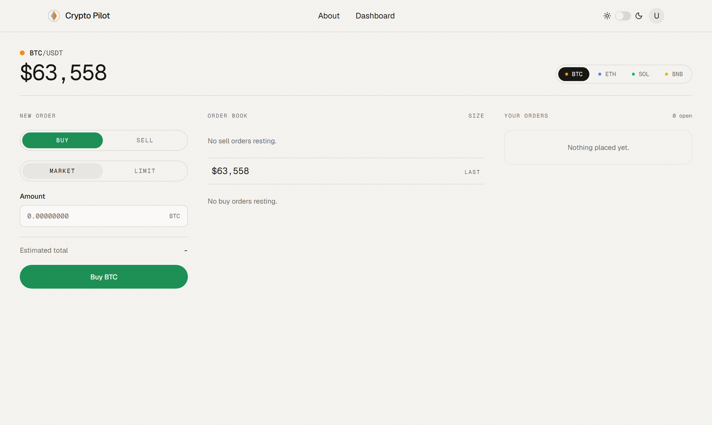
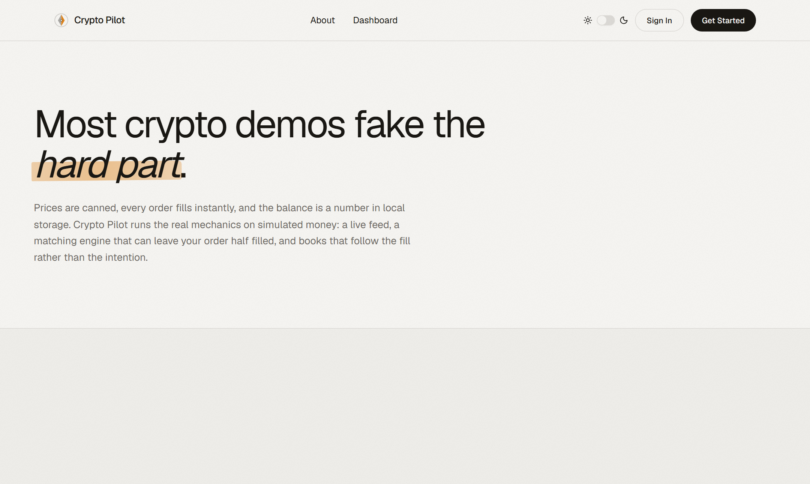

<div align="center">



<br />

# Crypto Pilot

**A crypto trading platform that runs the real mechanics on simulated money.**

Live prices stream from Binance over a websocket. Orders rest on an actual order book
and match against other users, so a fill can come back partial and stay partial.
An AI copilot answers against your live positions.

<br />

[](https://cryptopilot.up.railway.app)

<br />


</div>

> [!NOTE]
> **Funds are simulated.** Prices are real, positions are not, and nothing is custodied.

---

## Contents

[What it does](#what-it-does) · [Screens](#screens) · [Architecture](#architecture) · [Design system](#design-system) · [Local development](#local-development) · [Environment](#environment) · [Deploying](#deploying-to-railway) · [Limitations](#known-limitations)

---

## What it does

|   | Feature | How it works |
|:-:|---|---|
| 📈 | **Live market data** | Binance.US ticker stream fanned out to every client over one Socket.IO server. No API key, no polling. |
| 📖 | **Order book** | Limit orders rest until price reaches them. Market orders take from what is resting. |
| ⚙️ | **Matching engine** | Matches across users. Tracks `open`, `partially_filled`, `filled` and `cancelled` as distinct states. |
| 💼 | **Portfolio** | Positions valued against the live feed, derived from filled quantity rather than order size. |
| 🏦 | **Deposits / withdrawals** | Simulated chain confirmations advanced by a background watcher. |
| 🤖 | **AI copilot** | OpenAI, prompted with your real positions and open orders. |
| 🔐 | **Auth** | JWT access tokens, argon2-hashed refresh tokens in httpOnly cookies. |

---

## Screens

<table>
<tr>
<td width="50%">

**Dashboard**

Portfolio value, a relative-performance chart indexed to 100 at session start, and live holdings.



</td>
<td width="50%">

**Trading**

Depth-weighted order book, market and limit tickets, and your open orders.



</td>
</tr>
<tr>
<td colspan="2">

**About** &nbsp;·&nbsp; a scroll-pinned sequence walking one order from placed to filled



</td>
</tr>
</table>

---

## Architecture

REST and websockets share a single HTTP server and a single port.

```
   Binance ticker
         │
         ▼
   ┌───────────────────────────────┐
   │           backend             │
   │                               │
   │   REST  /api      Express 5   │──────► every open tab
   │   matching engine (in process)│        via Socket.IO
   │   MongoDB replica set         │
   └───────────────────────────────┘
                 ▲
                 │  fills return to your book
```

- REST is mounted under `/api` &nbsp;·&nbsp; `backend/src/server.ts`
- Socket.IO attaches to the same server &nbsp;·&nbsp; `backend/src/websocket/priceSocket.ts`
- The frontend sends `Authorization: Bearer <token>`; refresh and logout also use httpOnly cookies

> [!IMPORTANT]
> **MongoDB must be a replica set.** Signup wraps user and profile creation in a
> transaction, which a standalone `mongod` cannot serve. On Railway, use the
> **MongoDB Single Replica** template rather than the plain MongoDB one, and connect
> with `REPLICA_SET_PRIVATE_URI`.

```
crypto-pilot/
├── frontend/    React 19 · Vite 7 · TypeScript · Tailwind v4 · Motion · GSAP
└── backend/     Express 5 · TypeScript · Mongoose · Socket.IO · OpenAI
```

The two apps are independent. No npm workspace links them: each has its own
`package.json`, lockfile and deploy config, and each runs as its own Railway service.

---

## Design system

The interface is built on one idea:

> **The only colour on the page is the market.**

The page is paper and ink. Green and red appear only where real price data does, so
colour carries meaning instead of decoration. Amber is the single brand accent,
reserved for identity, hover and focus, and kept deliberately off the green/red axis
so a highlight can never be misread as a market signal.

| | Token | Role |
|:-:|---|---|
| ⬜ | `--paper` · `--paper-sunk` | Warm off-white ground, never pure white |
| ⬛ | `--foreground` | Warm near-black ink, never pure black |
| 🟧 | `--brand` | Amber. Logo, hover, focus rings, marker sweep |
| 🟩🟥 | `--market-up` · `--market-down` | Price moved. Nothing else may use these |
| 🟠🟣🟢🟡 | `--asset-btc` · `-eth` · `-sol` · `-bnb` | Per-asset identity in charts and lists |

**Shape rule**, applied without exception: pill buttons, 12px cards, 10px inputs.

**Type** is Geist, with Geist Mono for every number, always tabular so columns do not
jitter as prices tick.

**Motion has to earn its place.** Scroll reveals carry hierarchy, the price flash
signals a real change, and About pins a horizontal sequence because the argument is
literally about the states between placed and filled. Everything collapses under
`prefers-reduced-motion`.

Deliberately avoided: the dark-navy, electric-violet, neon-glow palette that every
crypto product and every AI-generated fintech page reaches for.

---

## Local development

Requires Node >= 20.

### Against the deployed backend (fastest)

```bash
cd frontend
npm install
npm run dev
```

`frontend/.env.local` is gitignored and already set up for this. It points
`VITE_API_URL` at a relative `/api`, and Vite proxies `/api` and `/socket.io` to the
deployed backend. Because the browser only ever talks to the dev server, every request
is same-origin and **CORS never applies**, so you can sign in locally without touching
the backend's allow-list.

<details>
<summary>If you do not have that file</summary>

```bash
# frontend/.env.local
VITE_API_URL=/api
VITE_DEV_API_PROXY=https://backend-production-39be5.up.railway.app
VITE_DEV_PROXY_ORIGIN=https://cryptopilot.up.railway.app
```

`VITE_DEV_PROXY_ORIGIN` makes the proxy present an origin the deployed backend already
allows. Drop it when proxying to a local backend.

</details>

### Full stack locally

```bash
# terminal 1
cd backend
cp .env.example .env       # fill in MONGO_URL and the three JWT secrets
npm install
npm run dev                # http://localhost:3000

# terminal 2
cd frontend
npm install
npm run dev                # set VITE_DEV_API_PROXY=http://localhost:3000
```

Generate each JWT secret separately. All three must be at least 32 characters:

```bash
node -e "console.log(require('crypto').randomBytes(48).toString('hex'))"
```

---

## Environment

<details open>
<summary><b>Backend</b></summary>

| Variable | Required | Notes |
|---|:--:|---|
| `MONGO_URL` | ✅ | Replica-set connection string. `MONGO_URI` is read as a fallback. |
| `JWT_SECRET_KEY` | ✅ | ≥ 32 chars, or the app throws on sign in |
| `JWT_REFRESH_KEY` | ✅ | ≥ 32 chars |
| `RESET_PASSWORD_SECRET` | ✅ | ≥ 32 chars |
| `FRONTEND_URL` | ✅ | Allowed origins, comma separated, no trailing slash. Drives both Express CORS and Socket.IO. |
| `CROSS_SITE_COOKIES` | | `true` when frontend and backend are on different domains over HTTPS |
| `OPENAI_API_KEY` | | Without it `POST /api/chat` returns 500. Everything else works. |
| `BINANCE_WS` | | Optional override. The default public stream needs no key. |

> [!WARNING]
> Do not set `PORT`. Railway injects it, and setting it manually breaks the health check.

</details>

<details open>
<summary><b>Frontend</b></summary>

| Variable | Required | Notes |
|---|:--:|---|
| `VITE_API_URL` | ✅ | Backend base. `/api` is appended if missing. |
| `VITE_SOCKET_URL` | | Derived from `VITE_API_URL`. Only set if they diverge. |
| `VITE_BASE_PATH` | | Only for subpath hosting such as GitHub Pages. |

> [!WARNING]
> `VITE_*` values are inlined into the bundle at **build** time. Changing one requires
> a redeploy, not a restart.

</details>

---

## Deploying to Railway

Two services from this one repo, plus a database.

```
① MongoDB Single Replica    the plain MongoDB template is standalone; signup will fail
② backend                   root: backend    build: npm ci && npm run build    start: npm start
③ frontend                  root: frontend   build: npm ci && npm run build    start: npm start
```

Set the backend's `MONGO_URL` to the replica set's `REPLICA_SET_PRIVATE_URI`.

There is a circular dependency between the two services: the backend needs
`FRONTEND_URL`, the frontend needs `VITE_API_URL`. Resolve it by deploying the backend
with a placeholder, deploying the frontend against it, then setting the backend's real
`FRONTEND_URL` and redeploying.

Both services build from their own Dockerfile. The frontend's accepts `VITE_API_URL` as
a build arg, since Vite needs it before `npm run build`.

---

## Scripts

```bash
# frontend                        # backend
npm run dev      dev server       npm run dev      nodemon + ts-node
npm run build    tsc -b && vite   npm run build    tsc
npm run lint     eslint           npm start        node dist/index.js
```

---

## Known limitations

Stated plainly rather than buried.

- **Funds are simulated.** Deposits and withdrawals are advanced by a watcher that
  fakes chain confirmations. No wallet is ever touched.
- **Password reset emails go nowhere.** The mailer points at an Ethereal test inbox,
  which is a sink.
- **Avatar upload is disabled.** It used a BunnyCDN write key from client-side code,
  where any visitor could read it. It needs to move behind the backend first.
- **Order book depth is illustrative** when no counter-orders exist. Real resting
  orders replace it as soon as there are any.
- The matching engine has rough edges around cancelling partially filled orders.

---

<div align="center">
<sub>Built by <a href="https://github.com/BaoT1301">Bao Tran</a></sub>
</div>
